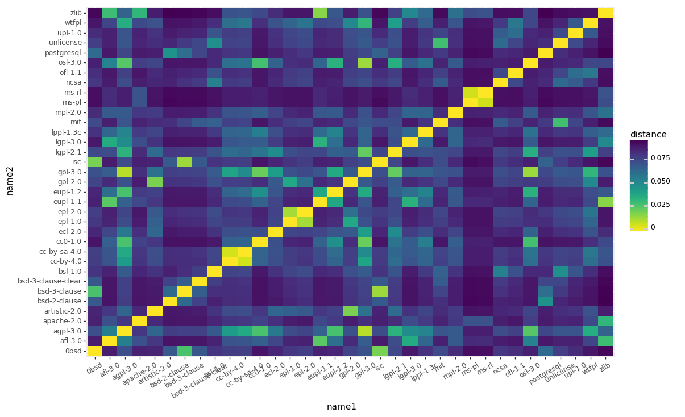

# Normalized compression distance (NCD)

Normalized compression distance (NCD) is a way of measuring the similarity between two sequences.

A [compression algorithm](https://en.wikipedia.org/wiki/Data_compression) looks for patterns and repetitions in the input sequence to compress it. For example, instead of "abababab" we can say "(ab)x4". This is how [RLE](https://en.wikipedia.org/wiki/Run-length_encoding) works and this is the most simple and illustrative example of compression. The main idea of NCD is that a good compression algorithm compress concatenation of two sequences as good as they similar and much better than each sequence separately.

This conception was presented in the [Clustering by Compression](https://homepages.cwi.nl/~paulv/papers/cluster.pdf) paper by [Rudi Cilibrasi](https://cilibrar.com/) and [Paul Vitanyi](https://en.wikipedia.org/wiki/Paul_Vit%C3%A1nyi).

## Calculation

$$ NCD_{Z}(x,y)={\frac  {Z(xy)-\min\\{Z(x),Z(y)\\}}{\max\\{Z(x),Z(y)\\}}}. $$

+ `x` and `y` -- input sequences.
+ `Z(x)` -- size of compressed `x`.

So, how it works:

1. We calculate the size of the compressed concatenation of two sequences.
1. We subtract from this size the minimal size of these compressed sequences. Some properties of value on this step:
  1. If it is equal to the maximal size of these compressed sequences it means that size of concatenation's compression is equal to the sum of sizes of separate compression of each sequence. That is, the compression algorithm couldn't compress input data at all.
  1. If it is equal to 0 then concatenation's compressed size is the same as the compressed size of each of these sequences. It means that these sequences are the same.
1. We divide result from the previous step by the maximal size of these compressed sequences to normalize results. So, for the same sequences we will get 0, and for different -- 1.

## Normal Compressor

Ok, but what is `Z`? This is the size of compressed data by a normal compressor (`C`). Yeah, you can use any compression algorithm, but for non-normal compressors, you will get strange and non-comparable results. So, there are these properties:

1. **Idempotency**: `C(xx) = C(x)`. Without it, you wouldn't get 0 for the same sequences because `Z(xx) - Z(x) ≠ 0`.
2. **Monotonicity**: `C(xy) ≥ C(x)`. If you can find `C(xy) < C(x)` then `Z(xy) - min(Z(x), Z(y))` will be less than zero and all NCD will be less than zero.
3. **Symmetry**: `C(xy) = C(yx)`. Without it `NCD(xy) ≠ NCD(yx)`. You can ignore this property if you change `Z(xy)` on `min(Z(xy), Z(yx))` in the formula.
4. **Distributivity**: `C(xy) + C(z) ≤ C(xz) + C(yz)`. I'm not sure about this property. I guess this shows that compression really works and make compressed data not larger than the input sequence. Also, I think, there should be `Z` instead of `C` (as for "Symmetry" property). So, we can say it simpler: `Z(xy) ≤ Z(x) + Z(y)`.

So, none of the real world compressors really works for NCD:

1. Idempotency can't be satisfied without dropping out information that `x` sequence appears twice in the input data.
1. Monotonicity can be broken by header information of compressed data.
1. Symmetry also doesn't work for most of the compressors because concatenation of sequences can make a new pattern. For example, for RLE `C("abb" + "bbc") = "ab4c"` and `C("bbc" + "abb") = "b2cab2"`.
1. For any real compressor, we will get discrete `Z` that equals to the size in bytes of compressed data, but this discretization makes more difficult to make difference between short sequences.

So, what can we use? In the original paper authors used real compressors like `Zlib` because these properties approximately work for really big and quite random sequences. But can we do it better?

## Entropy

[Entropy](https://bit.ly/1dm77MT) shows how many information contains this char in the given alphabet. For example, if you're playing in the "guess the word" game and know that this word starts from "e" it's not informative for you because of too many words in English start from "e". Otherwise, if you know that word starts from "x" then you should just try a few words to win (I guess, it's "x-ray").

So, we can calculate entropy for any letter in the alphabet (or element in a sequence):

$$ S=-\sum \_{i}P\_{i}\log\_{2} {P\_{i}} $$

Let's calculate entropy for sequence "test":

$$ S=(-{\frac {2}{4}}\log\_{2}{\frac {2}{4}})[t] + (-{\frac {1}{4}}\log\_{2}{\frac {1}{4}})[e] + (-{\frac {1}{4}}\log\_{2}{\frac {1}{4}})[s] = \frac {2}{4} + \frac {2}{4} + \frac {2}{4} = 1.5 $$


## Use entropy in NCD

[Entropy encoding](https://en.wikipedia.org/wiki/Entropy_encoding) is a kind of compression algorithms that compress data by making entropy of input sequence higher. A sequence with low entropy has big redundancy, and we can encode this message better. For example, we can encode every bigram in the text by new codes and make encode for most frequent bigrams ("th" for English) with the shortest code. This is how [Huffman coding](https://en.wikipedia.org/wiki/Huffman_coding) works. So, Entropy of a sequence proportional to the size of compressed data, because sequence with lower entropy we can compress better.

If we want to use entropy as `Z` in `NCD` we have one issue to solve. Entropy could be 0, so we could catch division by zero in the `NCD` formula. To avoid this we can add to every entropy result 1. It doesn't affect numerator (because we subtract one `Z` from another), but make denominator not equal to zero. It changes deviation of `Z` but saves all properties of the normal compressor.

Also, we can a little bit patch `NCD` formula to compare more than 2 sequences:

$$NCD_{Z}(x,y)={\frac  {Z(xy)-(n-1)\min\\{Z(x),Z(y)\\}}{\max\\{Z(x),Z(y)\\}}}.$$

Where `n` is the count of sequences.

## Let's practice!

I've implemented Entropy-based NCD in the [textdistance](https://github.com/orsinium/textdistance) Python library. Let's get it and have a look at the results for different synthetic input sequences.

```python
>>> from textdistance import entropy_ncd
```

The same sequences have 0 distance, totally different -- 1:

```python
>>> entropy_ncd('a', 'a')
0.0
>>> entropy_ncd('a', 'b')
1.0
>>> entropy_ncd('a', 'a' * 40)
0.0
```

More differences -- higher distance:

```python
>>> entropy_ncd('text', 'text')
0.0
>>> entropy_ncd('text', 'test')
0.1
>>> entropy_ncd('text', 'nani')
0.4
```

Elements order and repetitions doesn't matter:

```python
>>> entropy_ncd('test', 'ttse')
0.0
>>> entropy_ncd('test', 'testsett')
0.0
```

Distance depends on the size difference between strings:

```python
>>> entropy_ncd('a', 'bc')
0.792481250360578
>>> entropy_ncd('a', 'bcd')
0.7737056144690833
>>> entropy_ncd('a', 'bbb')
0.8112781244591329
>>> entropy_ncd('a', 'bbbbbb')
0.5916727785823275
>>> entropy_ncd('aaaa', 'bbbb')
1.0
```

Sometimes Entropy-based NCD gives non-intuitive results:

```python
>>> entropy_ncd('a', 'abbbbbb')
0.5097015764645563
>>> entropy_ncd('a', 'aaaaaab')
0.34150514509881796
>>> entropy_ncd('aaaaaaa', 'abbbbbb')
0.6189891221936807
```

## Most similar licenses

Let's compare texts of licenses from [choosealicense.com](https://choosealicense.com/):

```bash
git clone https://github.com/github/choosealicense.com.git
```

We will get the name of license as command line argument, compare its text with text of each other license and sort results by distance:

```python
from itertools import islice
from pathlib import Path
from sys import argv
from textdistance import EntropyNCD

# read files
licenses = dict()
for path in Path('choosealicense.com', '_licenses').iterdir():
  licenses[path.stem] = path.read_text()

# show licenses list if no arguments passed
if len(argv) == 1:
  print(*sorted(licenses.keys()), sep='\n')
  exit(1)

# compare all with one
qval = int(argv[1]) if argv[1] else None
compare_with = argv[2]
distances = dict()
for name, content in licenses.items():
  distances[name] = EntropyNCD(qval=qval)(
    licenses[compare_with],
    content,
  )

# show 5 most similar
sorted_distances = sorted(distances.items(), key=lambda d: d[1])
for name, distance in islice(sorted_distances, 5):
  print('{:20} {:.4f}'.format(name, distance))
```

Ok, let's have a look which qval works better:

```bash
# calculate entropy for chars
$ python3 compare.py 1 gpl-3.0
gpl-3.0              0.0000
agpl-3.0             0.0013
osl-3.0              0.0016
cc0-1.0              0.0020
lgpl-2.1             0.0022

# calculate entropy for bigrams
$ python3 compare.py 2 gpl-3.0
gpl-3.0              0.0000
agpl-3.0             0.0022
bsl-1.0              0.0058
gpl-2.0              0.0061
unlicense            0.0065

# calculate entropy for words (qval=None)
$ python3 compare.py "" gpl-3.0
gpl-3.0              0.0000
agpl-3.0             0.0060
gpl-2.0              0.0353
lgpl-2.1             0.0381
epl-2.0              0.0677
```

Calculating entropy by words looks most promising. Let's calculate it for some other licenses:

```bash
$ python3 compare.py "" mit    
mit                  0.0000
bsl-1.0              0.0294
ncsa                 0.0350
unlicense            0.0372
isc                  0.0473

$ python3 compare.py "" bsd-3-clause
bsd-3-clause         0.0000
bsd-3-clause-clear   0.0117
bsd-2-clause         0.0193
ncsa                 0.0367
mit                  0.0544

python3 compare.py "" apache-2.0
apache-2.0           0.0000
ecl-2.0              0.0043
osl-3.0              0.0412
mpl-2.0              0.0429
afl-3.0              0.0435
```

Now, let's make heatmap! I use [plotnine](https://github.com/has2k1/plotnine) for charts, this is Python clone of the [ggplot2](https://ggplot2.tidyverse.org/index.html).

```python
distances = []
for name1, content1 in licenses.items():
  for name2, content2 in licenses.items():
    distances.append((name1, name2, EntropyNCD(qval=None)(content1, content2)))

import plotnine as gg
import pandas as pd

df = pd.DataFrame(distances, columns=['name1', 'name2', 'distance'])

(
  gg.ggplot(df)
  + gg.geom_tile(gg.aes(x='name1', y='name2', fill='distance'))
  # reverse colors
  + gg.scale_fill_continuous(
    palette=lambda *args: gg.scale_fill_continuous().palette(*args)[::-1],
  )
  + gg.theme(
    figure_size=(12, 8),  # make chart bigger
    axis_text_x=gg.element_text(angle=90),  # rotate ox labels
  )
)        
```



What we can see here:

1. NCD detects families of licenses: `gpl-*`, `bsd-*`, `cc-by-*`, `epl-*`, `eupl-*`, `ms-*`.
1. [wtfpl](https://en.wikipedia.org/wiki/WTFPL) and [zlib](https://en.wikipedia.org/wiki/Zlib_License) are the most unusual licenses.
1. Most similar licenses: [cc-by-4.0](https://creativecommons.org/licenses/by/4.0/) and [cc-by-sa-4.0](https://creativecommons.org/licenses/by-sa/4.0/)
1. Most different licenses: [gpl-3.0](https://en.wikipedia.org/wiki/GNU_General_Public_License#Version_3) and [wtfpl](https://en.wikipedia.org/wiki/WTFPL).
1. Some similar licenses from different families:
    1. [ecl-2.0](https://en.wikipedia.org/wiki/Educational_Community_License) and [apache-2.0](https://en.wikipedia.org/wiki/Apache_License) (right, `ecl-2.0` is the modified `apache-2.0`).
    1. [afl-3.0](https://en.wikipedia.org/wiki/Academic_Free_License) and [osl-3.0](https://en.wikipedia.org/wiki/Open_Software_License) (they have the same author).
    1. [mit](https://en.wikipedia.org/wiki/MIT_License) and [bsl-1.0](https://en.wikipedia.org/wiki/Boost_Software_License) (they have almost the same last paragraph and similar permissions).
    1. [0bsd](https://opensource.org/licenses/0BSD) and [isc](https://en.wikipedia.org/wiki/ISC_license) (`0bsd` is an alteration of the `isc`).

## Further reading

1. [Clustering by Compression](https://homepages.cwi.nl/~paulv/papers/cluster.pdf)
1. [Compression-based Similarity](https://homepages.cwi.nl/~paulv/papers/ccp11.pdf)
1. [Article on the Wikipedia](https://en.wikipedia.org/wiki/Normalized_compression_distance)
1. [Discussion about NCD with Rudi Cilibrasi](https://github.com/orsinium/textdistance/issues/21)
1. [List of all distance calculation algorithms](https://github.com/orsinium/textdistance#algorithms)
