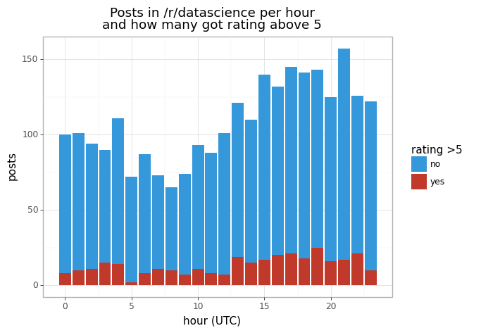
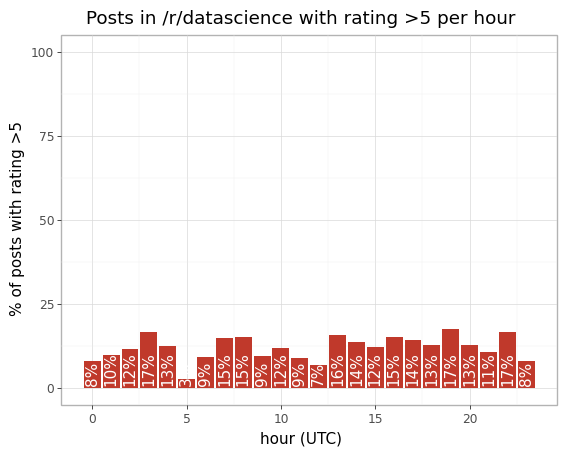
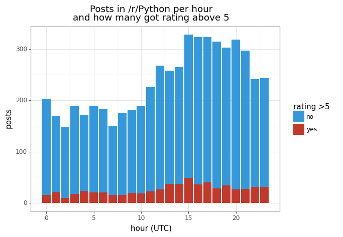
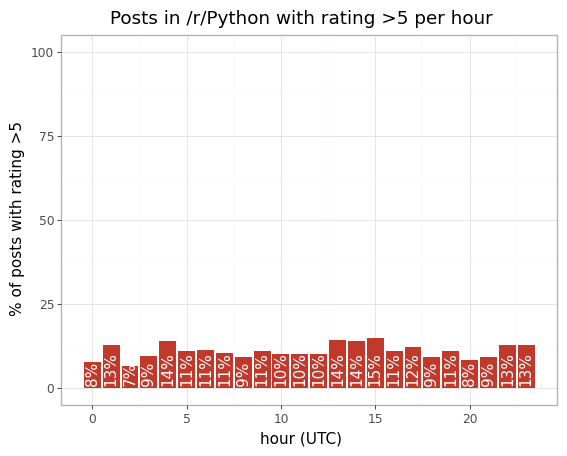
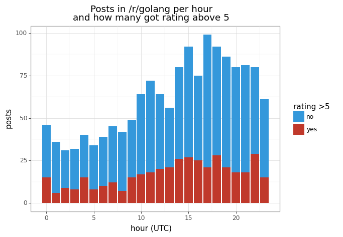
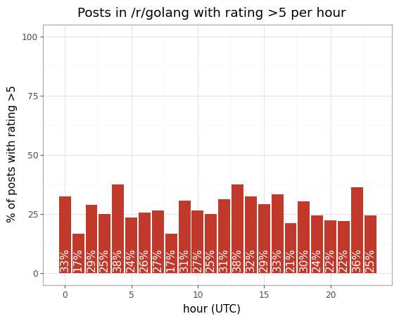

# Analyzing reddit posts

## Dataset

First of all, we need dataset. We could use the Reddit API but it has quite a small number of posts you can retrieve. Luckily, you cna find dump of everything from reddit at [files.pushshift.io/reddit](https://files.pushshift.io/reddit/). Let's download a few datasets:

```bash
wget https://files.pushshift.io/reddit/submissions/RS_2020-02.zst
wget https://files.pushshift.io/reddit/submissions/RS_2020-03.zst
```

Next, we need to read the data and select only subreddits and columns we're interested in. Every dataset takes a lot even compressed (over 5 Gb), and uncompressed will take much more, up to 20 times. So, instead we will read every line one-by-one, decide if we need it, and only then process. We can do it using [zstandard](https://pypi.org/project/zstandard/) library (and [tqdm](https://tqdm.github.io/) to see how it is going).

```python
from datetime import datetime
import json
import io

import zstandard
from tqdm import tqdm

paths = [
    '/home/gram/Downloads/RS_2020-02.zst',
    '/home/gram/Downloads/RS_2020-03.zst',
]
subreddits = {'python', 'datascience'}
posts = []

for path in paths:
    with open(path, 'rb') as fh:
        dctx = zstandard.ZstdDecompressor()
        stream_reader = dctx.stream_reader(fh)
        text_stream = io.TextIOWrapper(stream_reader, encoding='utf-8')
        for line in tqdm(text_stream):
            post = json.loads(line)
            if post['subreddit'].lower() not in subreddits:
                continue
            posts.append((
                datetime.fromtimestamp(post['created_utc']),
                post['domain'],
                post['num_comments'],
                post['id'],
                post['score'],
                post['subreddit'],
                post['title'],
            ))
```

On my machine, it took about half an hour to complete. So, take a break.

## Pandas

Let's convert the filtered data into a [pandas](https://pandas.pydata.org/) data frame:

```python
import pandas
df = pandas.DataFrame(posts, columns=['created', 'domain', 'comments', 'id', 'score', 'subreddit', 'title'])
df.head()
```

At this point, we can save the data frame, so later we can get back to work without need to filter data again:

```python
# dump
df.to_pickle('filtered.bin')
# load
df = pandas.read_pickle('filtered.bin')
```

## Number

Let's see some numbers. Feel free to play with the data as you like. For example, this is the percent of posts with the rating above a threshold:

```python
threshold = 5
subreddit = 'python'

(df[df.subreddit.str.lower() == subreddit.lower()].score > threshold).mean()
```

## Table

Now, we'll make a new dataset where the amount of total and survived (having the rating above 5) posts is calculated for every hour:

```python
# filter the subreddit
df2 = df[df.subreddit.str.lower() == subreddit.lower()]
# leave only the hour and the flag if the post is survived
df2 = pandas.DataFrame(dict(
    hour=df2.created.apply(lambda x: x.hour),
    survived=df2.score > threshold,
))
# group by hour, find how many survived and how many in total posts in every hour
df2 = df2.groupby(['hour'], as_index=False)
df2 = pandas.DataFrame(dict(
    hour=range(24),
    survived=df2.survived.sum().survived,
    total=df2.count().survived,
))
```

## Charts

Now, let's draw charts. This is what you need:

+ [Jupyter Lab](https://jupyterlab.readthedocs.io/en/stable/) to easier display and debug the charts.
+ [plotnine](https://plotnine.readthedocs.io/en/stable/) to draw.

Chart for total and survived posts:

```python
import plotnine as gg
(
    gg.ggplot(df2)
    + gg.theme_light()
    + gg.geom_col(gg.aes(x='hour', y='total', fill='"#3498db"'))
    + gg.geom_col(gg.aes(x='hour', y='survived', fill='"#c0392b"'))
    + gg.scale_fill_manual(name=f'rating >{threshold}' , guide='legend', values=['#3498db', '#c0392b'], labels=['no', 'yes'])
    + gg.xlab('hour (UTC)')
    + gg.ylab('posts')
    + gg.ggtitle(f'Posts in /r/{subreddit} per hour\nand how many got rating above {threshold}')
)
```

Chart for ratio:

```python
(
    gg.ggplot(df2)
    + gg.theme_light()
    + gg.geom_col(gg.aes(x='hour', y=f'survived / total * 100'), fill="#c0392b")
    + gg.geom_text(
        gg.aes(x='hour', y=1, label='survived / total * 100'),
        va='bottom', ha='center', angle=90, format_string='{:.0f}%', color='white',
    )
    + gg.xlab('hour (UTC)')
    + gg.ylab(f'% of posts with rating >{threshold}')
    + gg.ylim(0, 100)
    + gg.ggtitle(f'Posts in /r/{subreddit} with rating >{threshold} per hour')
)
```

## Results

There is what I've got for some subreddits.









